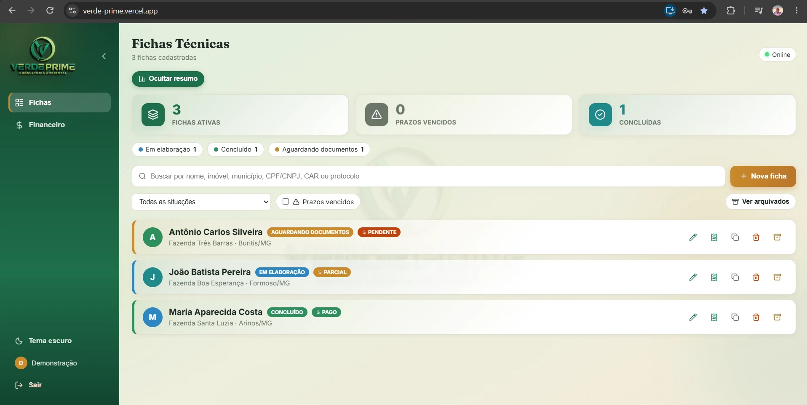
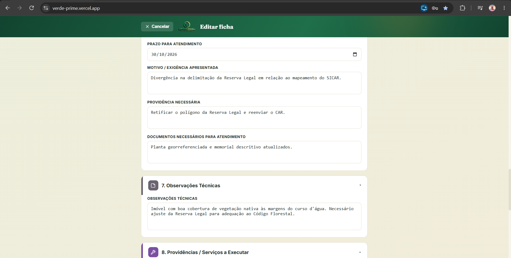
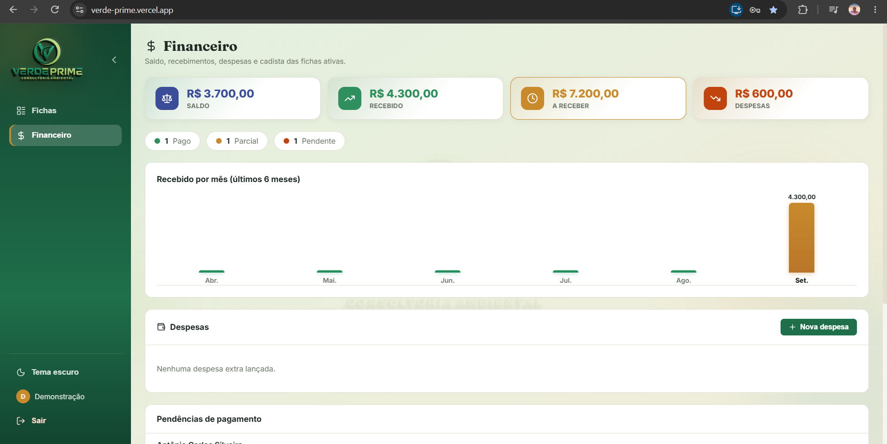
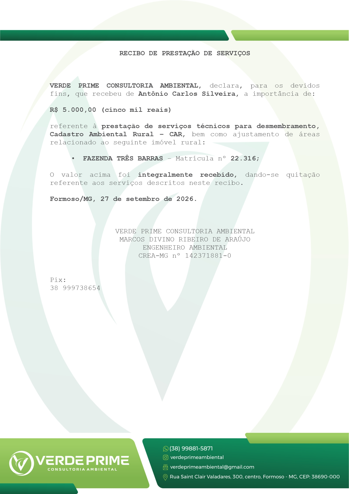

# 🌿 Verde Prime — Sistema de Fichas Técnicas

[](https://github.com/MarcosFso/verde-prime/actions/workflows/ci.yml)
[](LICENSE)

Sistema web full-stack para gestão de fichas técnicas de consultoria ambiental (Cadastro Ambiental Rural — CAR), desenvolvido para uso real por uma empresa de consultoria ambiental. Multi-usuário, com controle financeiro, geração de documentos em PDF e modo offline.

**🔗 Demo ao vivo:** [verde-prime.vercel.app](https://verde-prime.vercel.app)

### 👤 Entre e experimente

Há uma conta pública de demonstração, com três fichas fictícias, para você navegar pelo sistema sem precisar se cadastrar:

| | |
| --- | --- |
| **E-mail** | `teste@gmail.com` |
| **Senha** | `12345678` |

Nenhum dado real aparece ali: os CPFs foram gerados para passar na validação, os e-mails usam o domínio `example.com` (reservado para documentação) e os nomes não correspondem a ninguém. A conta é de usuário comum, sem privilégio de administrador — as políticas de Row Level Security do banco garantem que ela veja apenas as próprias fichas.

## 📸 Telas

| Lista de fichas | Ficha técnica |
| --- | --- |
|  |  |
| **Painel financeiro** | **Recibo gerado em PDF** |
|  |  |

## 🛠️ Tecnologias

- **Frontend:** React 18, Vite, CSS puro (sem framework de UI)
- **Backend:** Supabase (PostgreSQL, Autenticação, Storage)
- **Segurança:** Row Level Security (RLS) no banco de dados — cada usuário só acessa seus próprios dados; administradores têm acesso ampliado via políticas específicas
- **PWA:** instalável, com suporte offline via Service Worker (`vite-plugin-pwa`)
- **Geração de PDF:** `html2pdf.js`, carregado sob demanda (code splitting) para não pesar o carregamento inicial
- **Ícones:** `lucide-react`

## ✨ Funcionalidades

- **Autenticação multi-usuário** com e-mail real, recuperação de senha e termos de uso (LGPD)
- **Perfis de administrador** — visualizam e gerenciam fichas e usuários de toda a equipe
- **Ficha técnica completa** com 13 seções (cadastrante, cadista, proprietário, imóvel, CAR, levantamento ambiental, documentação, notificações, protocolo, financeiro, etc.)
- **Controle financeiro por ficha** — valor do serviço, pagamentos parcelados com data, cálculo automático de saldo a receber
- **Painel financeiro consolidado** — saldo, recebido, a receber, despesas, gráfico de recebimentos por mês
- **Anexos** — fotos (com compressão automática) e documentos, armazenados de forma privada por usuário no Supabase Storage
- **Geração de PDF** — recibo de pagamento personalizado e exportação completa da ficha
- **Modo escuro / claro**
- **Modo offline (PWA)** — o app abre mesmo sem conexão; dados sincronizam quando a internet volta
- **Rascunho automático** — o formulário salva sozinho enquanto você digita
- **Logout automático por inatividade** (30 minutos)
- **Busca, filtros e ordenação** na lista de fichas

## 🔒 Segurança

O banco de dados usa **Row Level Security (RLS)** do PostgreSQL/Supabase: as regras de acesso são aplicadas diretamente no banco, não apenas na interface. Isso significa que mesmo que alguém tente acessar a API diretamente (fora da tela), as permissões continuam sendo respeitadas — usuários comuns só veem os próprios dados, administradores têm acesso ampliado via políticas específicas para cada tabela (fichas, despesas, perfis e arquivos anexados).

## 📁 Estrutura do projeto

```
src/
  api.js                 -> chamadas ao Supabase (autenticação, fichas, anexos, despesas)
  supabaseClient.js       -> conexão com o Supabase (lê as chaves do .env)
  config/sections.js      -> configuração dos campos/seções da ficha + tema de cores
  utils/                  -> máscaras, validações, compressão de imagem, cálculos financeiros, geração de PDF
  components/             -> telas e componentes (autenticação, lista, formulário, financeiro, admin)
  App.jsx                 -> roteamento de telas e estado global
```

## 🚀 Rodando localmente

1. Instale o [Node.js](https://nodejs.org) (18+)
2. Copie `.env.example` para `.env` e preencha com as suas próprias chaves do Supabase:
   ```
   VITE_SUPABASE_URL=https://seu-projeto.supabase.co
   VITE_SUPABASE_ANON_KEY=sua-chave-anon-aqui
   ```
3. Instale as dependências e rode:
   ```bash
   npm install
   npm run dev
   ```
   O site abre em `http://localhost:5173`.

## 🧪 Testes

```bash
npm test
```

São 34 testes cobrindo as regras de negócio que não podem errar: a escrita de valores por extenso no recibo (`mil e quinhentos reais`, incluindo casos como `um milhão de reais`), a validação de CPF e CNPJ pelos dígitos verificadores, as máscaras de telefone e moeda, e a classificação de pagamento de cada ficha em pendente, parcial ou pago.

A cada push, o GitHub Actions roda o lint, os testes e o build — é o que o selo no topo deste arquivo indica.

## 📦 Deploy

```bash
npm run build
```
Gera a pasta `dist/`, pronta para qualquer hospedagem estática (Vercel, Netlify, Cloudflare Pages). Configure as variáveis de ambiente (`VITE_SUPABASE_URL` e `VITE_SUPABASE_ANON_KEY`) no painel do serviço escolhido.

O projeto está publicado na Vercel, com **deploy automático a cada push** na branch principal: o serviço compila e publica sozinho, sem etapa manual.

## 📄 Licença

Distribuído sob a licença MIT. Veja [LICENSE](LICENSE).

---

*Projeto desenvolvido e mantido de ponta a ponta — banco de dados, autenticação, regras de segurança e interface.*
